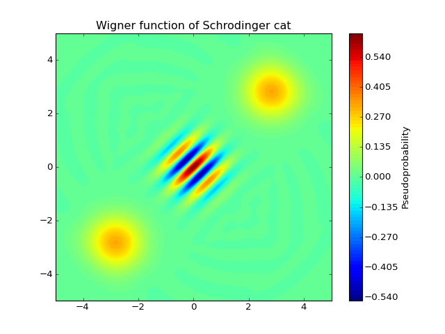
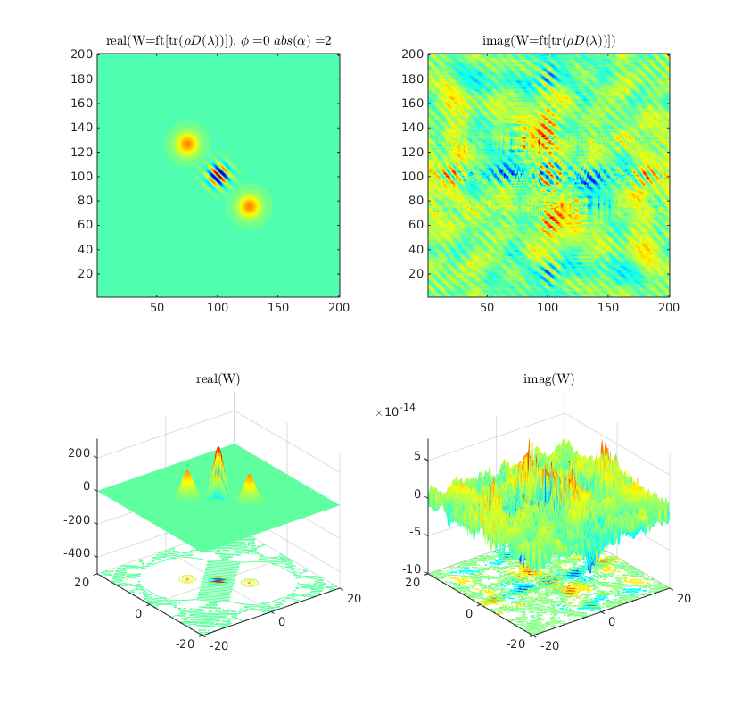

# projectSiegen
[Project Summary](summary.pdf)

For Ali | Using Git
--

1. cd Desktop/drafts/projectSiegen
2. git status
3. git add .
4. git commit -am "message"
5. git push
6. git pull

Week 0 and 1
--

* Thursday (May 7) 
  * Landed in Germany
  
* Friday (May 8)
  * Met Ali
  * Read the perspective paper
  * Started reading the next paper (detailed version of the same, with weak measurements and what not)
  * Discussed the perspective paper

* Monday (May 11)
  * [official] Bus pass for travelling
  * [official] Bank account for DAAD
  * Attended Dr. Otfried's class | topic: contextuality
  * Talked to Roope | generalized measurements and quantum steering

* Tuesday (May 12)
  * Talked to Costentino
  * Talked to Nicolai
  * Read about Bohm's formulation of QM and thought of some possible interesting problems
  * Talked to Marius
  * Figured the contextuality business and was dissappointed
  
* Wednesday (May 13)
  * Discussed the following with Roope
    * Contextuality issue and related non local hidden variables
    * Exponentiating an unbounded operator issue
    * Concluding commutation relations from exponentiated commutations
    * Implementation of Causality in QM
  * Read about relation of Aharnov Bohm effect and non locality
  * Talked to Maria and Frank
  * Read more about gauge theories and the Aharnov Bohm Effect
  * Had a short discussion with Prof. Guehne about contextuality

* Thursday (May 14) [off]
  * Read about causality from Aharnovs book
  * Read the historical development of QM from Weinberg's book on QM (the guy I think also discusses contrained systems (Dirac's thing))

* Friday (May 15)
  * Read chapter 5 like one should
  * Discussed various things with Ali (given in the summary document)
  * Tried to think of new ideas to find peculiar features of non locality

* Saturday | Sunday (May 16, 17)
  * Life essentials
  * Thought about non local dynamics and how to construct a test for it
  * Started writing the thoughts systematically (but somehow, they seem to be worthless now)

Week 2
--

* Monday (May 18)
  * Otfried's class
  * Contextuality assumption is not equivalent to determinism | clarified
  * Talked to Zanna about Quantum Metrology
  * Starting reading this old paper again
  * MATLAB was installed by Marius
    
* Tuesday (May 19)
  * Read various sections from Knight (related to distributions etc.)
  * Tried plotting them on MATLAB. Ran into some issues
  * Tried thinking about new ideas

* Wednesday (May 20)
  * Aharnov's book, chapter 5 | in progress
  * Plotting the wigner function for coherent state | didn't work
  * Tried thinkin about new ideas

* Thursday (May 21)
  * Group Meeting
  * Seminar
  * Tried thinking about something new
  * Chapter 5, Aharnov's
  * Fixing FFT issue
  * Colloqium

* Friday (May 22)
  * Roope's lectures + exercise
  * Again tried fixing the FFT issue
  * Done reading chapter 5 Aharnov (have some difficulties I must discuss with Otfried)

* Weekend (May 23, 24)
  * Thought of possible issues with the code, didn't work

Week 3
--
* Monday (May 25)
  * Read the New Journal of Physics paper by Aharnov et al
    * WWM
    * Modular variables
    * Observing Non locality using Weak Measurements

* Tuesday (May 26)
  * Roope's Lectures + Exercise
  * Discussion with Ali
    * Planned for the coming days
    * Figured the fault while explaining to him (in the Wigner function plot)
    * Decided to work on some small achievable goals
  * Wigner function worked (modulo the imaginary part)

* Wednesday (May 27)
  * Improved the code, fixed the imaginary part issue
  * Talked to Ali further
    * Exponential expectation value issue
    * Suggested reading the paper on Modular Variables and AB
  * Revising old concepts needed for the AB with modular variables paper

* Thursday (May 28)
  * Group Meeting
  * Aharnov Paper (AB with modular variables)
  * Reading chapter 4 from aharnov's book (fine read, without notes)
  * Watched partially a seminar on `50 years of AB fx'
  * Thought of some ideas

* Friday (May 29)
  * AB effect for Photons
  * Roope's Lecture
  * More Ideas from Aharnov's book, the seminar plus independent
  * AB effect for Bell Test
  * Discussed partially the NJP paper with Ali
  * Ideas

* Weekend (May 30, 31)
  * Nothing worthwhile :(

Week 4
--
* Monday (June 1)
  * Chapter 4, notes
  * Resumed presenting the paper to Ali + discussions [noted interesting facts]
  * Ideas (from Seminar + otherwise)

* Tuesday (June 2)
  * Misc maintainence tasks
  * Realized a possible unification of AB effect with photon cat states
  * Worked on documenting the basics of the photon AB effect as an article

* Wednesday (June 3)
  * Continued to work on documenting the photon AB effect and thought about how to implement it
  * Discussed with Ali (various ideas/methods came up)

* Thursday (June 4) [officially off in Germany]
  * Health + Social protocols

* Friday (June 5)
  * Thought of a quantization scheme that might produce the photon AB in lab
  * New relavent papers looked at (Ali sent)
  * Discussed the NJP paper by Aharnov with Ali
  * Decided how to proceed with small achievable goals

* Saturday Sunday (June 6, 7) [Weekend]
  * Read the photon-phonon paper (nature)
  * Glanced through the modular variable based entanglement paper

Week 5
--

* Monday (June 8)
  * Ottfried's lecture (EPR and Bell)
  * Various possibly new things: Modular variables in finite dimension systems, Deriving some properties of Modular variables, Electric AB effect for photon inspired by Photon Phonon AB effect (Nature)
  * Seminars: Basics of Bohm mechanics, Bell's perspectives

* Tuesday (June 9)
  * Worked on finding the eigenkets of pmod and xmod
  * Seminars: Multiworld (where the photon's been), Twisters, Twin Bell

* Wednesday (June 10)
  * Finally derived the eigenkets, couldn't prove equivalence though
  * Wrote a small code to plot these | worked  
  * Seminar: Bell thm, locality is the only assumption
  * Ali: concluded what to do with ideas from Monday

* Thursday (June 11)
  * Continuous variable bell test: Moulding the qubit case closer
  * Mathematica: Tutorial + worked out code for one term in CHSH 
  * Seminar: Bohmian mechanics fixing measurement problem etc.

* Friday (June 12)
  * Mathematica alternatives
  * Mathematica code for CHSH | no violation yet
  * Discussed with Ali about different possibilities
  * Seminar: Something about Bell, interesting ending

* Saturday Sunday (June 13, 14) [Weekend]
  * Might have **figured how to do the Bell test with a q,p settting**

Week 6 (shortened hereafter)
--

* Monday (June 15) 
  * **Worked out the details for Bell test in q,p setting, even when N is not infty**
  * Otfried Lecture

* Tuesday (June 16)
  * Attempting a more general derivation of eigenkets for the Bell Test | failed
  * Roope's Lecture

* Wednesday (June 17)
  * Guest Lecture: Detlef Duerr
  * Attempted further | failed
  * GHZ using continuous variables paper

* Thursday, Friday (June 18, 19) [UNWELL]

* Saturday, Sunday (June 20, 21) [Weekend]
  * Reading the GHZ paper, found similarity between mine and theirs, the approach that is.

Week 7
--

* Monday (June 22)
  * Completed typing the article
  * Read the GHZ paper (not fully clear yet)
  * Ali suggested additions

* Tuesday (June 23)
  * GHZ paper
  * Showed my operators are bounded unlike parity
  * Thought about how to measure

* Wednesday (June 24)
  * Inconsistencies found in measurement methods
  * Discussions + `Non local young experiment' started reading

* Thursday (June 25)
  * Extempore speaker @ the group meeting [Otfried etc. weren't there]
  * Reading `Non local young'

* Friday (June 26)
  * **Figured how to implement measurements**!

* Saturday, Sunday (june 27, 28) [weekend]
  * Documentation + thinking about state prep (last seeming step)

Week 8
--

* Monday (June 29)
  * Working on how to construct the entangled state

* Tuesday (June 30)
  * **Figured how to construct the state**!
  * Finalized the scheme of the draft

* Wednesday (July 1)
  * Essential progress in writing the draft

* Thursday (July 2) [headache]
  * Issue with deriving ft on the screen
  * No wavefunction for photon
  * Presentation prep

* Friday (July 3)
  * **Presentation | otfried**, he seemd to have liked it
  * Commutation relation progress

* Saturday (July 4)
  * **Commutation relations and mod elegence**
  * Polarization mistake spotted, fixed

* Sunday (July 5)
  * Working on report
  * **Setup for massive particles figured** using electric AB and stern gerlach

Week 9
--

* Monday (Jul 6)
  * Working on the draft (finalized PRA)

* Tuesday (Jul 7)
  * Extension to GHZ (not proceeding with it)
  * Draft (added fermion part, polarizer issue, other fixes)

* Wednesday (Jul 8)
  * Draft (fixed physical implementation section etc., typos plus proof read)

* Thursday (Jul 9) [Not well]
  * Some GRE registration work + GRE words

* Friday (Jul 10)
  * Wigner func + Psi itself  

* Sat, Sun (Jul 10, 11)
  * Read about Bohmian mechanics

Week 10
--
* Monday (Jul 12)
  * Working on draft

* Tuesday (Jul 13)
  * Working on draft

* Wednesday (Jul 14)
  * Working on draft
  * **Weyl mapped $\hat X(\theta)$ found to be a $\cos(p+Z_+(q))$ like function!**
